# Развёртывание федерации удостоверений в Yandex Cloud на базе решения Keycloak c помощью Container Optimized Image 

Это fork репозитория [yandex-cloud-examples/yc-iam-federation-with-keycloak-vm](https://github.com/yandex-cloud-examples/yc-iam-federation-with-keycloak-vm). Вы сможете быстро развернуть федерацию удостоверений внутри Docker контейнера на ВМ из образа Container Optimized Image. 

> [!WARNING]  
> Пример использования модулей оптимизирован для быстрого и дешевого равертывания. Пожалуйста, используйте его только в тестовом окружении. В сравнении с origin репозиторием проведено множество упрощений и рационализаций использования ресурсов, что повлияет на безопасность и надёжность. Keycloak также запускается в dev режиме, это необходимо чтобы избежать билда Docker образа, подробнее [в документации Keycloak](https://keycloak.org/server/containers#_trying_keycloak_in_development_mode).

> [!NOTE]  
> В репозитории не реализована удобная конфигурация ролей пользователей, улучшение и переиспользование некоторых переменных. Coming soon...

## Оглавление
* [Fast start](#fast-start)
* [Описанние](#overview)
* [Порядок развёртывания](#deploy)
    * [Настройка профиля YC CLI](#yc-cli)
    * [Необходимые ресурсы](#resources)
    * [Необходимые роли](#roles)
    * [Конфигурирование пользователей](#user-config)
    * [Шаги](#steps)
        * [Переход в директорию examples/keycloak-deploy](#steps/cd-k-d)
        * [Скрипт env-yc.sh](#steps/env-yc)
        * ...
* [Архитектура](#arch)
    * [Модуль keycloak-deploy](#keycloak-deploy)
        * [Ресурсы](#keycloak-deploy/resources)
        * [Переменные](#keycloak-deploy/variables)
    * [Модуль keycloak-config](#keycloak-config)
        * [Ресурсы](#keycloak-config/resources)
        * [Переменные](#keycloak-config/variables)

---

## Fast start<a id="fast-start"/></a>

0. Клонируйте репозиторий.

    ```
    git clone https://github.com/maqmm/yc-coivm-federation.git
    ```

1. Создайте или убедитесь в корректности конфигурации [профиля YC CLI](#yc-cli); проверьте, что существуют [ресурсы для быстрого запуска](#resources); у аккаунта, используемого в профиле YC CLI есть [необходимые роли](#roles).

2. Сразу после клонирования репозитория, для создания федерации выполните команду:

    ```
    cd yc-coivm-federation/examples/keycloak-deploy && terraform init && source ../env-yc.sh && terraform apply -auto-approve && cd ../keycloak-config && terraform init && bash ./sync.sh && bash ./wait_for_keycloak.sh && terraform apply -auto-approve ; cd ..
    ```

После инициализации, __находясь в каталоге `examples` можно__:

* создавать ресурсы

    ```
    cd keycloak-deploy && source ../env-yc.sh && terraform apply -auto-approve && cd ../keycloak-config && bash ./sync.sh && bash ./wait_for_keycloak.sh && terraform apply -auto-approve ; cd ..
    ```

* удалять ресурсы

    ```
    cd keycloak-config && source ../env-yc.sh && terraform destroy -auto-approve && cd ../keycloak-deploy && terraform destroy -auto-approve ; cd ..
    ```

---

## Описание<a id="overview"/></a>
Подробную информацию о схеме работы и функционировании федераций можно прочитать в [origin репозитории](https://github.com/yandex-cloud-examples/yc-iam-federation-with-keycloak-vm?tab=readme-ov-file#overview) или [документации Yandex Cloud](https://yandex.cloud/ru/docs/organization/concepts/add-federation). 
Примерное взаимодействие браузера пользователя, SP и IdP при входе показано на схеме:


1. Пользователь переходит по ссылке `https://console.yandex.cloud/federations/<FED_ID>`. Происходит несколько редиректов к `auth.yandex.cloud`. Генерируется SAMLRequest. В браузер возвращается редирект к SSO URL, указанный в федерации удостоверений.

2. Браузер переходит по указанному location в редиректе. В URL query params подставлен SAMLRequest. IdP валидирует SAMLRequest и отправляет форму ввода аутентификационных данных в HTML странице.

3. Пользователь заполняет форму. После нажатия кнопки отправляется POST запрос. IdP валидирует введенные данные. Если проверка прошла успешно, на стороне IdP генерируется SAMLResponse, подставляется в готовый POST запрос, который в свою очередь подставляется в HTML auto-submit форму, которая выполняется при загрузке HTML документа.

4. Браузером загружается страница с формой и POST запрос с SAMLResponse отправляется к SP по ASC USL. Происходит редирект на `https://console.yandex.cloud/`.

### Плюсы относительно [origin репозитория](https://github.com/yandex-cloud-examples/yc-iam-federation-with-keycloak-vm?tab=readme-ov-file#overview):






```mermaid
---
config:
    themeVariables:
        xyChart:
            backgroundColor: "#00000000"
            plotColorPalette: "#858585, #4492f7"
---
xychart-beta
    title "Время развертывания"
    x-axis ["origin", "this rep"]
    y-axis "Time (in min)" 2 --> 15
    bar [15, -999]
    bar [-999, 3]
```

```mermaid
---
config:
    themeVariables:
        xyChart:
            backgroundColor: "#00000000"
            plotColorPalette: "#858585, #4492f7"
---
xychart-beta
    title "Примерная стоимость ресурсов"
    x-axis ["origin", "this rep"]
    y-axis "Cost (in ₽ per day)" 2 --> 330
    bar [327, -999]
    bar [-999, 36]
```

### Отличия от [origin репозитория](https://github.com/yandex-cloud-examples/yc-iam-federation-with-keycloak-vm?tab=readme-ov-file#overview)
* Вместо Managed PostgreSQL кластера используется dev-file самого Keycloak.
* [Keycloak](https://keycloak.org/server/containers) запускается в виде Docker контейнера на ВМ из образа [Container Optimized Image](https://yandex.cloud/ru/docs/cos/concepts/).
* Поддерживается переиспользование и определение уже выпущенного [Let's Encrypt](https://letsencrypt.org/) сертификата, что увеличивает скорость развертывания.

---

## Порядок развёртывания<a id="deploy"/></a>

### Настройка профиля YC CLI<a id="yc-cli"/></a>

Для начала рекомендую [создать отдельный профиль YC CLI](https://yandex.cloud/ru/docs/cli/operations/profile/profile-create).

<details>
<summary><em>Почему?</em></summary>
При выполнении скрипта <code>env-yc.sh</code> устанавливается <a href="#steps/env-yc/env">множество переменных</a>. В их числе есть IAM-токен, если вы захотите запустить apply через 12 часов, вам снова необходимо обновить переменные с помощью <code>source ../env-yc.sh</code>, так как IAM-токен к этому времени истекет. По умолчанию в скрипте используется текущий профиль YC CLI, если за эти 12 часов вы использовали и активировали другой профиль, то потребуется изменить профиль обратно. Это может быть не совсем удобно. Для определения в скрипте конкрентного профиля, независимо от текущего, воспользуйтесь советом ниже.
</details>

> [!NOTE] 
> Вы можете создать отдельный профиль YC CLI для использования с этой конфигурацией. После этого указать его имя в переменной `YC_PROFILE=""` файла [env-yc.sh](./examples/env-yc.sh#L4), а потом активировать любой необходимый. После сохранения файла во всех его командах будет использоваться указанный профиль вместо текущего по умолчанию.

При настройке профиля помимо аутентификационных данных укажите:
- ID облака - `yc config set cloud-id <id>`
- ID каталога - `yc config set folder-id <id>`
- ID организации, если не указать будет использована организация облака - `yc config set organization-id <id>`

### Необходимые ресурсы<a id="resources"/></a>

#### Обязательные ресурсы:<a id="resources/required"/></a>

- [Публичная DNS зона](https://yandex.cloud/ru/docs/dns/concepts/dns-zone#public-zones)
    
    Если такая зона единственная в каталоге, скрипт [env-yc.sh](./examples/env-yc.sh) установит её id в значение переменной `dns_zone_exist`. В иных случаях, нужно указать ID или имя зоны в файле [examples/keycloak-deploy/main.tf](./examples/keycloak-deploy/main.tf) в переменных `dns_zone_id` или `dns_zone_name` соответственно. ID будет использовано с высшим приоритетом, чем имя.

- [Организация](https://yandex.cloud/ru/docs/organization/concepts/organization)
    
    Скрипт [env-yc.sh](./examples/env-yc.sh) установит значение переменной самостоятельно. Будет использован `organization-id` указанный в используемом профиле или получаит ID организации используемого облака.

- [Облако](https://yandex.cloud/ru/docs/resource-manager/concepts/resources-hierarchy#cloud)
    
    Скрипт [env-yc.sh](./examples/env-yc.sh) установит значение переменной самостоятельно. Будет использован `cloud-id` указанный в используемом профиле.

- [Каталог](https://yandex.cloud/ru/docs/resource-manager/concepts/resources-hierarchy#folder)
    
    Скрипт [env-yc.sh](./examples/env-yc.sh) установит значение переменной самостоятельно. Будет использован `folder-id` указанный в используемом профиле.

#### Необязательные ресурсы, ускоряющие равзвертывание:<a id="resources/recommended"/></a>

- [Сертификат LE](https://yandex.cloud/ru/docs/certificate-manager/concepts/managed-certificate)
    
    Скрипт [env-yc.sh](./examples/env-yc.sh) установит значение переменной `kc_cert_exist` самостоятельно, если для FQDN Kycloak'а существует выпущенный сертификат в каталоге. В этой же переменной можно указать ID любого другого __подходящего__ сертфиката. Сильно усеньшает время развертывания.

    Если переменная `kc_cert_exist` не указана или пустая, то нужный сертификат будет создан с именем из переменной `le_cert_name`, необходимая CNAME запись создастся в DNS-зоне. Terraform будет ожидать валидацию и выпуск сертификата. При выполнении `destroy` такой сертификат имеет параметр `prevent_destroy = true` и будет запрещать `destroy` с ошибкой. Чтобы оставить сертификат для дальнейших деплоев выполните команду `terraform state rm module.keycloak-deploy.yandex_cm_certificate.kc_le_cert` или измените в файле [keycloak-deploy/dns-cm.tf](./keycloak-deploy/dns-cm.tf) на `prevent_destroy = false` для удаления сертификата.

- [Подсеть](https://yandex.cloud/ru/docs/vpc/concepts/network#subnet)
    
    Не устанавливается самостоятельно в примере. Можно указать ID существующей подсети в файле [examples/keycloak-deploy/main.tf](./examples/keycloak-deploy/main.tf) в переменной `kc_subnet_exist`, тогда новые сеть и подсеть создаваться не будут.

### Необходимые роли<a id="roles"/></a>

Минимальные необходимые роли при использовании [созданных ресурсов](#resources/recommended):
- `dns.editor` на DNS-зону или каталог
- `compute.editor` на каталог
- `vpc.publicAdmin` на каталог
- `vpc.securityGroups.admin` на каталог
- `certificate-manager.certificates.downloader` на каталог
- `organization-manager.federations.admin` на организацию

Если `kc_subnet_exist` не указан и вместо существующей подсети создается сеть и подсеть, понадобится:
- роль `vpc.privateAdmin`

    или
- роль `vpc.admin` вместо трёх ролей `vpc.publicAdmin`, `vpc.privateAdmin`, `vpc.securityGroups.admin`

Если `kc_cert_exist` не указан и вместо существующего сертификата будет создан новый, понадобится:
- роль `certificate-manager.editor`

    или
- роль `certificate-manager.admin` вместо двух ролей `certificate-manager.certificates.downloader` и `certificate-manager.editor`

> [!CAUTION]  
> Отсутствие у аккаунта роли `resource-manager.clouds.member` на облако позволит создать все ресурсы, но негативно повлияет на получение ID организации для облака в скрипте [env-yc.sh](./examples/env-yc.sh). В таком случае укажите ID организации в используемом профиле CLI командой `yc config set organization-id <id>` или в переменной `org_id` файла [examples/keycloak-config/main.tf](./examples/keycloak-config/main.tf).

> [!CAUTION]  
> Использование роли `dns.editor` на конкретной необходимой зоне вместо каталога отнимает у аккаунта возможность получить список зон каталога. В таком случае автоустановка единственной в каталоге зоны с помощью скрипта [env-yc.sh](./examples/env-yc.sh) будет не работать. Укажите ID или имя зоны в файле [examples/keycloak-deploy/main.tf](./examples/keycloak-deploy/main.tf) в переменных `dns_zone_id` или `dns_zone_name` соответственно.

> [!CAUTION]  
> При проблемах с удалением федеративных пользователей из организации добавьте аккаунту роль `organization-manager.admin` на организацию, вместо/к роли `organization-manager.federations.admin`. Это связано с особенностями провайдера.

### Конфигурирование пользователей<a id="user-config"/></a>
...

---

### Пошагово разберем какие действия выполняются в каждой из частей сборной команды:<a id="steps"/></a>

```
cd yc-coivm-federation/examples/keycloak-deploy && terraform init && source ../env-yc.sh && terraform apply -auto-approve && cd ../keycloak-config && terraform init && bash ./sync.sh && bash ./wait_for_keycloak.sh && terraform apply -auto-approve ; cd ..
```

#### Переход в директорию [examples/keycloak-deploy](./examples/keycloak-deploy) и инициализация<a id="steps/cd-k-d"/></a>

Изменение директории после `git clone https://github.com/maqmm/yc-coivm-federation.git`:
```
cd yc-coivm-federation/examples/keycloak-deploy
```

Инициализация провайдеров модуля `keycloak-deploy`:
```
terraform init
```

#### Скрипт `env-yc.sh`, устанавливающий переменные окружения<a id="steps/env-yc"/></a>

Команда `source` использует текущий shell для экспорта переменных окружений, на основе которых будет выполняться `terraform plan & apply`. При изменении shell'а или истечения 12 часов валидности IAM токена, выполняйте команду:

```
source ../env-yc.sh
```

##### Устанавливаются следующие переменные окружения:<a id="steps/env-yc/env"/></a>
| __Переменная__ | __Значение__ |
| ---         | ---         |
| `YC_TOKEN` | IAM-токен, полученный с помощью команды `yc iam create-token` |
| `TF_VAR_YC_CLOUD_ID` | ID облака, указанного в профиле |
| `TF_VAR_YC_FOLDER_ID` | ID каталога, указанного в профиле |
| `TF_VAR_YC_ORGANIZATION_ID` | ID организации |
| `TF_VAR_YC_ZONE_ID` | ID публичной DNS зоны |
| `TF_VAR_CERTIFICATE_ID` | ID сертификата |

##### Шаги<a id="steps/env-yc/steps"/></a>

1. Использует для выполнения команд текущий профиль YC CLI. Подробнее про [настройку профиля YC CLI](#yc-cli).
2. Устанавливает переменную `YC_TOKEN` командой `yc iam create-token`.
3. Устанавливает переменную `TF_VAR_YC_CLOUD_ID` командой `yc config get cloud-id`.
4. Устанавливает переменную `TF_VAR_YC_FOLDER_ID` командой `yc config get folder-id`.
5. Устанавливает переменную `TF_VAR_YC_ORGANIZATION_ID` командой `yc config get organization-id`, но если `organization-id` не указана в используемом профиле получает ID организации используемого выше облака командой `yc resource-manager cloud get`.
6. Устанавливает переменную `TF_VAR_YC_ZONE_ID`, если в указанном выше каталоге одна публичная зона.
7. Ищет файлы `main.tf`, если в обоих файлах `kc_adm_pass = ""`, генерирует и подставляет значения между кавычек. _(нужно для безопасности при клонировании репозитория)_
8. Использует зону из следующих источников (отсортировано по уменьшению приоритета): сначала `dns_zone_id` из файла [examples/keycloak-deploy/main.tf](./examples/keycloak-deploy/main.tf); `dns_zone_name` из файла [examples/keycloak-deploy/main.tf](./examples/keycloak-deploy/main.tf); `TF_VAR_YC_ZONE_ID` установленный в пункте 6, если в каталоге единственная публичная DNS зона. 
    Получает `kc_hostname` из файла [examples/keycloak-deploy/main.tf](./examples/keycloak-deploy/main.tf). 
    Устанавливает переменную `TF_VAR_CERTIFICATE_ID`, записывая в неё id `ISSUED` сертификата, если такой существует в каталоге для полученного ранее в этом пункте FQDN: `<kc_hostname>.<ZONE>`.
9. Выводит переменные, которые удалось установить с помощью `echo`.

---

## Архитектура решения<a id="arch"/></a>

В примере используется образ [Container Optimized Image](https://yandex.cloud/ru/docs/cos/concepts/), для виртуальной машины. [Keycloak](https://keycloak.org/server/containers) запускается из Docker образа, переданного в [Docker Compose](https://yandex.cloud/ru/docs/cos/concepts/coi-specifications#compose-spec) спецификацию, в виде [метаданных ВМ](https://yandex.cloud/ru/docs/compute/concepts/vm-metadata).

Решение разбито на два модуля, поскольку [Keycloak Terraform провайдер](https://github.com/keycloak/terraform-provider-keycloak) требует уже работающего (alive) Keycloak, а [блоки `provider` не поддерживают `depends_on`](https://discuss.hashicorp.com/t/depends-on-in-providers/42632).

### Модуль keycloak-deploy<a id="keycloak-deploy"/></a>

#### Ресурсы модуля keycloak-deploy<a id="keycloak-deploy/resources"/></a>

Граф зависимостей ресурсов модуля. Полузакрашенные ресурсы не будут созданы, если есть и указаны уже существующие.


| __Ресурс__ | __Описание__ |  |  |  |
| ---         | ---         | ---         | ---         | ---         |
| `data.yandex_resourcemanager_folder.kc_folder` | Data-source для получения информации о каталоге. | [T](https://registry.terraform.io/providers/yandex-cloud/yandex/latest/docs/data-sources/resourcemanager_folder) | [M](https://terraform-provider.yandexcloud.net/data-sources/resourcemanager_folder) | [Y](https://yandex.cloud/ru/docs/resource-manager/concepts/resources-hierarchy#folder) |
| `null_resource.copy_certificates` | Ресурс для копирования сертификата LE на ВМ. Внутри себя использует [provisioners](https://developer.hashicorp.com/terraform/language/resources/provisioners/syntax#how-to-use-provisioners) и данные от созданной ВМ для копирования via SSH. | [T](https://registry.terraform.io/providers/hashicorp/null/latest/docs/resources/resource) |  |  |
| _VPC_ |
| `yandex_vpc_network.kc_net` | Ресурс создания облачной сети с именем `kc_network_name`, в каталоге `data.yandex_resourcemanager_folder.kc_folder`. Не будет создана при указывании в модуле переменной `kc_subnet_exist`. | [T](https://registry.terraform.io/providers/yandex-cloud/yandex/latest/docs/resources/vpc_network) | [M](https://terraform-provider.yandexcloud.net/resources/vpc_network) | [Y](https://yandex.cloud/ru/docs/vpc/concepts/network#network) |
| `yandex_vpc_subnet.kc_subnet` | Ресурс создания облачной подсети с именем `kc_subnet_name`, с CIDR `10.10.10.0/24`, в сети = `yandex_vpc_network.kc_net`, в зоне доступности `kc_zone_id`, в каталоге `data.yandex_resourcemanager_folder.kc_folder`. Не будет создана при указывании в модуле переменной `kc_subnet_exist`. | [T](https://registry.terraform.io/providers/yandex-cloud/yandex/latest/docs/resources/vpc_subnet) | [M](https://terraform-provider.yandexcloud.net/resources/vpc_subnet) | [Y](https://yandex.cloud/ru/docs/vpc/concepts/network#subnet) |
| `data.yandex_vpc_subnet.kc_subnet_existing` | Data-source для получения информации о существующей подсети с id `kc_subnet_exist`. При объявлении переменной `kc_subnet_exist` не создаются ресурсы `yandex_vpc_network.kc_net` и `yandex_vpc_subnet.kc_subnet`. В [examples/](./examples/) не используется. | [T](https://registry.terraform.io/providers/yandex-cloud/yandex/latest/docs/data-sources/vpc_subnet) | [M](https://terraform-provider.yandexcloud.net/data-sources/vpc_subnet) | [Y](https://yandex.cloud/ru/docs/vpc/concepts/network#subnet) |
| `yandex_vpc_security_group.kc_sg` | Ресурс создания группы безопасности, которая будет привязана на интерфейс ВМ. Создаётся в сети `yandex_vpc_network.kc_net` или в сети, которой принадлежит подсеть `data.yandex_vpc_subnet.kc_subnet_existing`. Разрешает весь исходящий трафик, разрешает TCP трафик с портов 22 и `kc_port`, разрешает ICMP трафик. | [T](https://registry.terraform.io/providers/yandex-cloud/yandex/latest/docs/resources/vpc_security_group) | [M](https://terraform-provider.yandexcloud.net/resources/vpc_security_group) | [Y](https://yandex.cloud/ru/docs/vpc/concepts/security-groups) |
| `yandex_vpc_address.kc_pub_ip` | Ресурс создания публчиного IP-адреса в зоне доступности `kc_zone_id`, в каталоге `data.yandex_resourcemanager_folder.kc_folder`. | [T](https://registry.terraform.io/providers/yandex-cloud/yandex/latest/docs/resources/vpc_address) | [M](https://terraform-provider.yandexcloud.net/resources/vpc_address) | [Y](https://yandex.cloud/ru/docs/vpc/concepts/address#public-addresses) |
| _Compute_ |
| `data.yandex_compute_image.kc_image` | Data-source для получения информации о последнем образе семейства `kc_image_family` из каталога `standard-images`. | [T](https://registry.terraform.io/providers/yandex-cloud/yandex/latest/docs/data-sources/compute_image) | [M](https://terraform-provider.yandexcloud.net/data-sources/compute_image) | [Y](https://yandex.cloud/ru/docs/compute/concepts/image) |
| `yandex_compute_instance.kc_vm` | Ресурс создания виртуальной машины платформы `standard-v3` в зоне доступности `kc_zone_id`. Используется `kc_vm_cores` ядер, `kc_vm_memory` оперативной памяти. Загрузочный диск типа `network-ssd` создается из образа `data.yandex_compute_image.kc_image` размером `min_disk_size` образа + 18GB. Сетевой интерфейс использует SG `yandex_vpc_security_group.kc_sg` и адрес `yandex_vpc_address.kc_pub_ip`. В метаданные ВМ после заполнения шаблонов передаются: user-data из файла [keycloak-deploy/kc-vm-user-data.tpl](./keycloak-deploy/kc-vm-user-data.tpl) и спецификация docker-compose из файла [keycloak-deploy/kc-vm-docker-compose.tpl](./keycloak-deploy/kc-vm-docker-compose.tpl). | [T](https://registry.terraform.io/providers/yandex-cloud/yandex/latest/docs/resources/compute_instance) | [M](https://terraform-provider.yandexcloud.net/resources/compute_instance) | [Y](https://yandex.cloud/ru/docs/compute/concepts/vm) |
| _Cloud DNS_ |
| `data.yandex_dns_zone.kc_dns_zone` | Data-source для получения информации о DNS зоне из каталога `data.yandex_resourcemanager_folder.kc_folder`. Использует `dns_zone_id` для получения зоны по id, если эта переменная пустая использует `dns_zone_name` для получения зоны по имени. Если обе переменные пустые, скрипт [env-yc.sh](./examples/env-yc.sh) заполняет переменную `dns_zone_exist` самостоятельно, если в каталоге существует только одна публичная зона. | [T](https://registry.terraform.io/providers/yandex-cloud/yandex/latest/docs/data-sources/dns_zone) | [M](https://terraform-provider.yandexcloud.net/data-sources/dns_zone) | [Y](https://yandex.cloud/ru/docs/dns/concepts/dns-zone#public-zones) |
| `yandex_dns_recordset.kc_dns_rec` | Ресурс создания A DNS-записи. Устанавливает субдомен из переменной `kc_hostname`. Запись ведет на публичный IP-адрес ВМ из ресурса `yandex_vpc_address.kc_pub_ip`. | [T](https://registry.terraform.io/providers/yandex-cloud/yandex/latest/docs/resources/dns_recordset) | [M](https://terraform-provider.yandexcloud.net/resources/dns_recordset) | [Y](https://yandex.cloud/ru/docs/dns/concepts/resource-record#a) |
| `yandex_dns_recordset.validation_dns_rec` | Ресурс создания DNS-записи для валидации LE сертификата `yandex_cm_certificate.kc_le_cert`. Значения для записи используются из челленджа ресурса сертификата. | [M](https://terraform-provider.yandexcloud.net/resources/dns_recordset) | [Y](https://yandex.cloud/ru/docs/dns/concepts/resource-record#cname) |
| _Certificate Manager_ |
| `yandex_cm_certificate.kc_le_cert` | Ресурс создания сертификата LE с именем `le_cert_name`. Использует домен из переменной `kc_fqdn`, составленный из `kc_hostname` + DNS-зона. Не создаётся если id существующего сертификата передается в переменную `kc_cert_exist`. По умолчанию в модуле установлено `prevent_destroy = true`, чтобы при `destroy` нельзя было удалить сертификат и возникала ошибка, чтобы оставить сертификат для дальнейших деплоев выполните команду `terraform state rm module.keycloak-deploy.yandex_cm_certificate.kc_le_cert` или измените в файле [keycloak-deploy/dns-cm.tf](./keycloak-deploy/dns-cm.tf) на `prevent_destroy = false` для удаления сертификата. | [T](https://registry.terraform.io/providers/yandex-cloud/yandex/latest/docs/resources/cm_certificate) | [M](https://terraform-provider.yandexcloud.net/resources/cm_certificate) | [Y](https://yandex.cloud/ru/docs/certificate-manager/concepts/managed-certificate) |
| `data.yandex_cm_certificate.cert_existing` | Data-source для получения информации о существующем сертификате с id `kc_cert_exist`. Скрипт [env-yc.sh](./examples/env-yc.sh) заполняет переменную `kc_cert_exist` самостоятельно, если в каталоге существует ISSUED сертификат с подходящим под `kc_fqdn` доменом. | [T](https://registry.terraform.io/providers/yandex-cloud/yandex/latest/docs/data-sources/cm_certificate) | [M](https://terraform-provider.yandexcloud.net/data-sources/cm_certificate) | [Y](https://yandex.cloud/ru/docs/certificate-manager/concepts/) |
| `data.yandex_cm_certificate.cert_validated` | Data-source для получения информации о существующем сертификате. Использует `wait_validation = true` для ожидания выпущенного сертификата (`yandex_cm_certificate.kc_le_cert` или `data.yandex_cm_certificate.cert_existing`), прошедшего проверку. | [T](https://registry.terraform.io/providers/yandex-cloud/yandex/latest/docs/data-sources/cm_certificate) | [M](https://terraform-provider.yandexcloud.net/data-sources/cm_certificate) | [Y](https://yandex.cloud/ru/docs/certificate-manager/concepts/) |
| `data.yandex_cm_certificate_content.cert` | Data-source для получения контента (certificate, private key) сертификата. | [T](https://registry.terraform.io/providers/yandex-cloud/yandex/latest/docs/data-sources/cm_certificate_content) | [M](https://terraform-provider.yandexcloud.net/data-sources/cm_certificate_content) | [Y](https://yandex.cloud/ru/docs/certificate-manager/operations/managed/cert-get-content#tf_1) |
| `local_file.cert` | Ресурс создания локального файла `cert.pem` c `certificates` из `data.yandex_cm_certificate_content.cert`.  | [T](https://registry.terraform.io/providers/hashicorp/local/latest/docs/resources/file) |  |   |
| `local_file.key` | Ресурс создания локального файла `key.pem` c `private_key` из `data.yandex_cm_certificate_content.cert`.  | [T](https://registry.terraform.io/providers/hashicorp/local/latest/docs/resources/file) |  |   |

Чтобы получить название в _state_, нужно добавить префикс перед названием ресурса:
`module.keycloak-deploy.<название_ресурса_из_первого_столбца>`

#### Переменные модуля keycloak-deploy<a id="keycloak-deploy/variables"/></a>

В столбце __Порядок получения в примере__ указаны варианты получения этой переменной в [examples/](./examples/) при применении манифеста, от самого приоритетного к менее.

| __Переменная__ | __Дефолтное значение__ | __Тип__ | __Описание__ | __Порядок получения в примере__ |
| ---         | ---         | ---         | ---         | ---         |
| _Input variables_ |
| `cloud_id` | - | `string` | ID облака | 1. `var.YC_CLOUD_ID` указанное в [examples/keycloak-deploy/main.tf](./examples/keycloak-deploy/main.tf) из переменной `TF_VAR_YC_CLOUD_ID`, экспортированной скриптом [env-yc.sh](./examples/env-yc.sh) |
| `folder_id` | - | `string` | ID облака | 1. `var.YC_FOLDER_ID` указанное в [examples/keycloak-deploy/main.tf](./examples/keycloak-deploy/main.tf) из переменной `TF_VAR_YC_FOLDER_ID`, экспортированной скриптом [env-yc.sh](./examples/env-yc.sh) |
| `labels` | null | `map(string)` | Пары ключ/значения меток для ресурсов | 1. `{ tag = "keycloak-deploy" }` указанное в [examples/keycloak-deploy/main.tf](./examples/keycloak-deploy/main.tf)<br>2. `null` как значение модуля по умолчанию |
| _VM variables_ |
| `kc_image_family` | null | `string` | Семейство образов, используемых для ВМ | 1. `container-optimized-image` указанное в [examples/keycloak-deploy/main.tf](./examples/keycloak-deploy/main.tf) |
| `kc_preemptible` | `false` | `bool` | Прерываемая ли ВМ | 1. `true` указанное в [examples/keycloak-deploy/main.tf](./examples/keycloak-deploy/main.tf)<br>2. `false` как значение модуля по умолчанию |
| `kc_zone_id` | `ru-central1-d` | `string` | Зона размещения ВМ | 1. `ru-central1-d` указанное в [examples/keycloak-deploy/main.tf](./examples/keycloak-deploy/main.tf)<br>2. `ru-central1-d` как значение модуля по умолчанию |
| `kc_hostname` | `sso` | `string` | Будет использовано для `name` и `hostname` ВМ, а также как субдомен. | 1. `fed` указанное в [examples/keycloak-deploy/main.tf](./examples/keycloak-deploy/main.tf)<br>2. `sso` как значение модуля по умолчанию |
| `kc_vm_cores` | `2` | `number` | Количество vCPU ВМ | 1. `2` как значение модуля по умолчанию |
| `kc_vm_memory` | `2` | `number` | Количество RAM ВМ в GB | 1. `2` как значение модуля по умолчанию |
| `kc_vm_core_fraction` | `100` | `number` | Уровень производительности ВМ в процентах | 1. `100` как значение модуля по умолчанию |
| `kc_vm_username` | `admin` | `string` | Имя пользователя ВМ, передаваемое в метаданные | 1. `admin` указанное в [examples/keycloak-deploy/main.tf](./examples/keycloak-deploy/main.tf)<br>2. `admin` как значение модуля по умолчанию |
| `kc_vm_ssh_pub_file` | null | `string` | Путь и имя файла публичного SSH-ключа | 1. `~/.ssh/id_rsa.pub` указанное в [examples/keycloak-deploy/main.tf](./examples/keycloak-deploy/main.tf) |
| `kc_vm_ssh_priv_file` | null | `string` | Путь и имя файла публичного SSH-ключа | 1. Использует указанное в [examples/keycloak-deploy/main.tf](./examples/keycloak-deploy/main.tf) значени<br>2. Если не указано, то подставляется `null` по умолчанию, в модуле используется значение переменной `kc_vm_ssh_pub_file` с удаленным `.pub` |
| _Keycloak variables_ |
| `kc_ver` | `24.0.0` | `string` | Используемая версия Keycloak | 1. `26.1.1` указанное в [examples/keycloak-deploy/main.tf](./examples/keycloak-deploy/main.tf)<br>2. `24.0.0` как значение модуля по умолчанию |
| `kc_adm_user` | null | `string` | Имя пользователя администратора Keycloak | 1. `admin` указанное в [examples/keycloak-deploy/main.tf](./examples/keycloak-deploy/main.tf) |
| `kc_adm_pass` | null | `string` | Пароль администратора Keycloak | 1. Генерируется и подставляется значение при запуске скрипта [env-yc.sh](./examples/env-yc.sh) при условии что в обоих main.tf эта переменная равна `""` <br>2. `""` указанное в [examples/keycloak-deploy/main.tf](./examples/keycloak-deploy/main.tf) |
| _VPC variables_ |
| `kc_network_name` | null | `string` | Имя сети | 1. `forkc` указанное в [examples/keycloak-deploy/main.tf](./examples/keycloak-deploy/main.tf) |
| `kc_subnet_name` | null | `string` | Имя подсети | 1. `forkc-ru-central1-d` указанное в [examples/keycloak-deploy/main.tf](./examples/keycloak-deploy/main.tf) |
| `kc_subnet_exist` | null | `string` | ID существующей подсети. Если указать эту переменную подсеть и сеть создаваться не будут, а будет использоваться указанная подсеть. | - |
| `kc_port` | `8443` | `string` | Порт Keycloak | 1. `8443` указанное в [examples/keycloak-deploy/main.tf](./examples/keycloak-deploy/main.tf)<br>2. `8443` как значение модуля по умолчанию |
| `kc_vm_sg_name` | `kc-sg` | `string` | Имя группы безопасности | 1. `kc-sg` указанное в [examples/keycloak-deploy/main.tf](./examples/keycloak-deploy/main.tf)<br>2. `kc-sg` как значение модуля по умолчанию |
| _DNS zone variables_ |
| `dns_zone_id` | null | `string` | ID DNS зоны | Для создания DNS зоны:<br>1. Значение из `dns_zone_id`<br>2. Имя из `dns_zone_name`<br>3. Если публичная DNS зона одна в каталоге, то используется она из переменной `dns_zone_exist = var.YC_ZONE_ID` при запуске скрипта [env-yc.sh](./examples/env-yc.sh). |
| `dns_zone_name` | null | `string` | Имя DNS зоны | Для создания DNS зоны:<br>1. Значение из `dns_zone_id`<br>2. Имя из `dns_zone_name`<br>3. Если публичная DNS зона одна в каталоге, то используется она из переменной `dns_zone_exist = var.YC_ZONE_ID` при запуске скрипта [env-yc.sh](./examples/env-yc.sh).  |
| `dns_zone_exist` | null | `string` | ID единственной в каталоге DNS зоны | Для создания DNS зоны:<br>1. Значение из `dns_zone_id`<br>2. Имя из `dns_zone_name`<br>3. Если публичная DNS зона одна в каталоге, то используется она из переменной `dns_zone_exist = var.YC_ZONE_ID` при запуске скрипта [env-yc.sh](./examples/env-yc.sh).  |
| _LE Certificate variables_ |
| `kc_cert_exist` | null | `string` | ID готового сертификата, если указать сертификат не будет создаваться и валидироваться | 1. `var.CERTIFICATE_ID` указанное в [examples/keycloak-deploy/main.tf](./examples/keycloak-deploy/main.tf) из переменной `TF_VAR_CERTIFICATE_ID`, экспортированной скриптом [env-yc.sh](./examples/env-yc.sh) |
| `le_cert_name` | null | `string` | Имя сертификата, который будет создан | 1. `kc` указанное в [examples/keycloak-deploy/main.tf](./examples/keycloak-deploy/main.tf) |
| `le_cert_descr` | null | `string` | Описание сертификата, который будет создан | - |

### Модуль keycloak-config<a id="keycloak-config"/></a>

#### Ресурсы модуля keycloak-config<a id="keycloak-config/resources"/></a>

Граф зависимостей ресурсов модуля. Множественными элементами обозначены ресурсы, количество которых зависит от [конфигурации пользователей](#user-config).


| __Ресурс__ | __Описание__ |  |  |  |
| ---         | ---         | ---         | ---         | ---         |
| _Cloud Organization_ |
| `data.yandex_client_config.client` | Data-source для получения атрибутов провайдера. Токен, полученный таким способом используется в `null_resource.federation_cert` для API-запроса установки сертификата. | [T](https://registry.terraform.io/providers/yandex-cloud/yandex/latest/docs/data-sources/client_config) | [M](https://terraform-provider.yandexcloud.net/data-sources/client_config) |  |
| `yandex_organizationmanager_saml_federation.kc_fed` | Ресурс создания федерации удостоверений с именем `fed_name` в организации `org_id`. | [T](https://registry.terraform.io/providers/yandex-cloud/yandex/latest/docs/resources/organizationmanager_saml_federation) | [M](https://terraform-provider.yandexcloud.net/resources/organizationmanager_saml_federation) | [Y](https://yandex.cloud/ru/docs/organization/concepts/add-federation) |
| `null_resource.federation_cert` | Ресурс для получения сертификата realm'а по URL `https://${kc_fqdn}:${kc_port}/realms/${kc_realm_name}/protocol/saml/descriptor`. Затем сертификат устанавливается в федерацию удостоверений POST-запросом к `https://organization-manager.api.cloud.yandex.net/organization-manager/v1/saml/certificates`. | [T](https://registry.terraform.io/providers/hashicorp/null/latest/docs/resources/resource) |  | [Y](https://yandex.cloud/ru/docs/organization/saml/api-ref/Certificate/create) |
| `yandex_organizationmanager_saml_federation_user_account.org_users` | Ресурс создания федеративных пользователей в организации. Создается по такому ресурсу для каждого пользователя в `users`. Передаётся Name ID и ID федерации, которой пренадлежит пользователь. | [T](https://registry.terraform.io/providers/yandex-cloud/yandex/latest/docs/resources/organizationmanager_saml_federation_user_account) | [M](https://terraform-provider.yandexcloud.net/resources/organizationmanager_saml_federation_user_account) | [Y](https://yandex.cloud/ru/docs/organization/operations/add-account#user-sso) |
| _Keycloak_ |
| `keycloak_realm.realm` | Ресурс создания realm'а с именем `kc_realm_name` и отображаемым именем `kc_realm_descr`. | [T](https://registry.terraform.io/providers/keycloak/keycloak/latest/docs/resources/realm) |  | [K](https://www.keycloak.org/docs/latest/server_admin/index.html#proc-creating-a-realm_server_administration_guide) |
| `keycloak_saml_client.client` | Ресурс создания SAML-клиента. Подставляет ACS URL со страницы федерации в параметры `client_id`, `base_url`, `valid_redirect_uris`, `idp_initiated_sso_relay_state`. | [T](https://registry.terraform.io/providers/keycloak/keycloak/latest/docs/resources/saml_client) |  | [K](https://www.keycloak.org/docs/latest/server_admin/index.html#_client-saml-configuration) |
| `keycloak_realm_user_profile.user_profile` | Ресурс кофигурирования схемы профиля пользователя. Устанавливаются атрибуты и их правила валидации. Атрибуты можно будет установить созданным пользователям. | [T](https://registry.terraform.io/providers/keycloak/keycloak/latest/docs/resources/realm_user_profile) |  | [K](https://www.keycloak.org/docs/latest/server_admin/index.html#managing-the-user-profile) |
| `random_password.user_password` | Ресурс создания паролей для всех пользователей из `users`. Пароль будет использован только для пользователей без указанного пароля, подробнее в [конфигурировании пользователей](#user-config).  | [T](https://registry.terraform.io/providers/hashicorp/random/latest/docs/resources/password) |  |  |
| `keycloak_user.users` | Ресурс создания пользователей, перечисленных в `users`. Подробнее в [конфигурировании пользователей](#user-config). | [T](https://registry.terraform.io/providers/keycloak/keycloak/latest/docs/resources/user) |  | [K](https://www.keycloak.org/docs/latest/server_admin/index.html#proc-creating-user_server_administration_guide) |
| `keycloak_saml_user_property_protocol_mapper.property_email` | Ресурс создания протокол-маппера, позволяющего мапить свойства из Keycloak модели пользователя в атрибут SAML assertion. `email` | [T](https://registry.terraform.io/providers/keycloak/keycloak/latest/docs/resources/saml_user_property_protocol_mapper) |  | [Y](https://yandex.cloud/ru/docs/organization/tutorials/federations/integration-keycloak#claims-mapping) |
| `keycloak_saml_user_property_protocol_mapper.property_surname` | Ресурс создания протокол-маппера, позволяющего мапить свойства из Keycloak модели пользователя в атрибут SAML assertion. `lastName` | [T](https://registry.terraform.io/providers/keycloak/keycloak/latest/docs/resources/saml_user_property_protocol_mapper) |  | [Y](https://yandex.cloud/ru/docs/organization/tutorials/federations/integration-keycloak#claims-mapping) |
| `keycloak_saml_user_property_protocol_mapper.property_givenname` | Ресурс создания протокол-маппера, позволяющего мапить свойства из Keycloak модели пользователя в атрибут SAML assertion. `firstName` | [T](https://registry.terraform.io/providers/keycloak/keycloak/latest/docs/resources/saml_user_property_protocol_mapper) |  | [Y](https://yandex.cloud/ru/docs/organization/tutorials/federations/integration-keycloak#claims-mapping) |
| `keycloak_saml_user_attribute_protocol_mapper.attribute_fullname` | Ресурс создания протокол-маппера, позволяющего мапить кастомный атрибут пользователя в атрибут SAML assertion. `name` | [T](https://registry.terraform.io/providers/keycloak/keycloak/latest/docs/resources/saml_user_attribute_protocol_mapper) |  | [Y](https://yandex.cloud/ru/docs/organization/tutorials/federations/integration-keycloak#claims-mapping) |
| `keycloak_saml_user_attribute_protocol_mapper.attribute_phone` | Ресурс создания протокол-маппера, позволяющего мапить кастомный атрибут пользователя в атрибут SAML assertion. `phone` | [T](https://registry.terraform.io/providers/keycloak/keycloak/latest/docs/resources/saml_user_attribute_protocol_mapper) |  | [Y](https://yandex.cloud/ru/docs/organization/tutorials/federations/integration-keycloak#claims-mapping) |
| `keycloak_saml_user_attribute_protocol_mapper.attribute_avatar` | Ресурс создания протокол-маппера, позволяющего мапить кастомный атрибут пользователя в атрибут SAML assertion. `thumbnailPhoto` | [T](https://registry.terraform.io/providers/keycloak/keycloak/latest/docs/resources/saml_user_attribute_protocol_mapper) |  | [Y](https://yandex.cloud/ru/docs/organization/tutorials/federations/integration-keycloak#claims-mapping) |
| `keycloak_generic_protocol_mapper.role_list_mapper` | Ресурс создания универсального протокол-маппера. `Role` | [T](https://registry.terraform.io/providers/keycloak/keycloak/latest/docs/resources/generic_protocol_mapper) |  |  |
| `keycloak_generic_protocol_mapper.group_membership` | Ресурс создания универсального протокол-маппера. `member` | [T](https://registry.terraform.io/providers/keycloak/keycloak/latest/docs/resources/generic_protocol_mapper) |  |  |

Чтобы получить название в _state_, нужно добавить префикс перед названием ресурса:
`module.keycloak-config.<название_ресурса_из_первого_столбца>`

#### Переменные модуля keycloak-config<a id="keycloak-config/variables"/></a>

В столбце __Порядок получения в примере__ указаны варианты получения этой переменной в [examples/](./examples/) при применении манифеста, от самого приоритетного к менее.

| __Переменная__ | __Дефолтное значение__ | __Тип__ | __Описание__ | __Порядок получения в примере__ |
| ---         | ---         | ---         | ---         | ---         |
| _Input variables_ |
| `labels` | null | `map(string)` | Пары ключ/значения меток для ресурсов | 1. `{ tag = "keycloak-config" }` указанное в [examples/keycloak-config/main.tf](./examples/keycloak-config/main.tf)<br>2. `null` как значение модуля по умолчанию |
| _Organization variables_ |
| `org_id` | null | `string` | ID организации, в которой будет создана федерация | 1. Установленное в [examples/keycloak-config/main.tf](./examples/keycloak-config/main.tf) с помощью скрипта [sync.sh](./examples/keycloak-config/sync.sh) значение переменной окружения `TF_VAR_YC_ORGANIZATION_ID`. Как устанавливается эта переменная скриптом [env-yc.sh](./examples/env-yc.sh) подробнее в [соответствующем разделе](#steps/env-yc/steps)<br>2. Если переменная не установлена (например скрипт [env-yc.sh](./examples/env-yc.sh) запускался в другом shell), можно указать ID организации вручную в [examples/keycloak-config/main.tf](./examples/keycloak-config/main.tf) или запустить `source ../env-yc.sh` |
| `fed_name` | null | `string` | Имя федерации `yandex_organizationmanager_saml_federation.kc_fed`. | 1. `kc` указанное в [examples/keycloak-config/main.tf](./examples/keycloak-config/main.tf) |
| _Keycloak variables_ |
| `kc_fqdn` | null | `string` | FQDN развернутого Keycloak | 1. Установленное в [examples/keycloak-config/main.tf](./examples/keycloak-config/main.tf) с помощью скрипта [sync.sh](./examples/keycloak-config/sync.sh) значение output `kc_fqdn` модуля `keycloak-deploy` |
| `kc_port` | null | `string` | Порт развернутого Keycloak | 1. Перенесенное в [examples/keycloak-config/main.tf](./examples/keycloak-config/main.tf) с помощью скрипта [sync.sh](./examples/keycloak-config/sync.sh) значение переменной из модуля `keycloak-deploy` |
| `kc_adm_user` | null | `string` | Имя пользователя администратора Keycloak | 1. Перенесенное в [examples/keycloak-config/main.tf](./examples/keycloak-config/main.tf) с помощью скрипта [sync.sh](./examples/keycloak-config/sync.sh) значение переменной из модуля `keycloak-deploy` |
| `kc_adm_pass` | null | `string` | Пароль администратора Keycloak | 1. Перенесенное в [examples/keycloak-config/main.tf](./examples/keycloak-config/main.tf) с помощью скрипта [sync.sh](./examples/keycloak-config/sync.sh) значение переменной из модуля `keycloak-deploy` |
| `kc_realm_name` | null | `string` | Имя realm'а `keycloak_realm.realm`, отображается в URL страницы входа. | 1. `My Keycloak Realm` указанное в [examples/keycloak-config/main.tf](./examples/keycloak-config/main.tf) |
| `kc_realm_descr` | null | `string` | Описание realm'а `keycloak_realm.realm`, отображается на страннице входа. | 1. `kc` указанное в [examples/keycloak-config/main.tf](./examples/keycloak-config/main.tf) |
| _Users configuration_ |
| `users` | null | `object({`<br>`  templates = optional(map(object({`<br>`    first_name = optional(string)`<br>`    last_name = optional(string)`<br>`    email_domain = optional(string)`<br>`    phone = optional(string)`<br>`    full_name = optional(string)`<br>`    password = optional(string)`<br>`    photo_path = optional(string)`<br>`    temporary_password = optional(bool)`<br>`    enabled = optional(bool)`<br>`  })))`<br>`  users = map(object({`<br>`    template = optional(string)`<br>`    first_name = optional(string)`<br>`    last_name = optional(string)`<br>`    email_domain = optional(string)`<br>`    phone = optional(string)`<br>`    full_name = optional(string)`<br>`    password = optional(string)`<br>`    photo_path = optional(string)`<br>`    temporary_password = optional(bool)`<br>`    enabled = optional(bool)`<br>`  }))`<br>`})` | Конфигурация, по которой будут созданы пользователи Keycloak. Подробности схемы описаны в [этом разделе](#user-config). | 1. JSON-файл [users.json](./examples/keycloak-config/users.json), в котором определены два пользователя `user1` и `user2`: `{"users": {"user1":{}, "user2":{}}}`; пароли пользователей, для которых они не указаны явно, будут сгенерированы ресурсом `random_password.user_password`; подробнее в [разделе конфигурации пользователей](#user-config). |