# Развёртывание федерации удостоверений в Yandex Cloud на базе решения Keycloak c помощью Container Optimized Image 

Это fork репозитория [yandex-cloud-examples/yc-iam-federation-with-keycloak-vm](https://github.com/yandex-cloud-examples/yc-iam-federation-with-keycloak-vm). Вы сможете быстро развернуть федерацию удостоверений внутри Docker контейнера на ВМ из образа Container Optimized Image. 

> [!WARNING]  
> Пример использования модулей оптимизирован для быстрого и дешевого равертывания. Пожалуйста, используйте его только в тестовом окружении. В сравнении с origin репозиторием проведено множество упрощений и рационализаций использования ресурсов, что повлияет на безопасность и надёжность. Keycloak также запускается в dev режиме, это необходимо чтобы избежать билда Docker образа, подробнее [в документации Keycloak](https://keycloak.org/server/containers#_trying_keycloak_in_development_mode).

> [!NOTE]  
> В репозитории не реализована удобная конфигурация пользователей, улучшение и переиспользование некоторых переменных. Coming soon...

## Оглавление
* [Fast start](#fast-start)
* [Описанние](#overview)
* [Архитектура](#arch)
    * [Модуль keycloak-deploy](#keycloak-deploy)
    * [Модуль keycloak-config](#keycloak-config)
* [Способы развёртывания](#deploy-ways)
* [Порядок развёртывания](#deploy)
* [Результаты резвёртывания](#results)

## Fast start <a id="fast-start"/></a>

0. 

```
git clone https://github.com/maqmm/yc-coivm-federation.git
```

1. Создайте профиль YC CLI; проверьте, что существуют ресурсы для быстрого запуска.

2. Сразу после клонирования репозитория, для создания федерации выполните команду:

```
cd yc-coivm-federation/examples/keycloak-deploy && terraform init && source ../env-yc.sh && terraform apply -auto-approve && cd ../keycloak-config && terraform init && bash ./sync.sh && bash ./wait_for_keycloak.sh && terraform apply -auto-approve ; cd ..
```

После инициализации, находясь в каталоге `examples` можно:

* создавать ресурсы
  
  ```
  cd keycloak-deploy && source ../env-yc.sh && terraform apply -auto-approve && cd ../keycloak-config && bash ./sync.sh && bash ./wait_for_keycloak.sh && terraform apply -auto-approve ; cd ..
  ```

* удалять ресурсы

  ```
  cd keycloak-config && terraform destroy -auto-approve && cd ../keycloak-deploy && terraform destroy -auto-approve ; cd ..
  ```

## Описание решения <a id="overview"/></a>
Подробную информацию о схеме работы и функционировании федераций можно прочитать в [origin репозитории](https://github.com/yandex-cloud-examples/yc-iam-federation-with-keycloak-vm?tab=readme-ov-file#overview) или [документации Yandex Cloud](https://yandex.cloud/ru/docs/organization/concepts/add-federation). Примерное взаимодействие браузера пользователя, SP и IdP показано на схеме:


1. Пользователь переходит по ссылке `https://console.yandex.cloud/federations/<FED_ID>`. Происходит несколько редиректов к `auth.yandex.cloud`. Генерируется SAMLRequest. В браузер возвращается редирект к SSO URL, указанный в федерации удостоверений.

2. Браузер переходит по указанному location в редиректе. В URL query params подставлен SAMLRequest. IdP валидирует SAMLRequest и отправляет форму ввода аутентификационных данных в HTML странице.

3. Пользователь заполняет форму. После нажатия кнопки отправляется POST запрос. IdP валидирует введенные данные. Если проверка прошла успешно, на стороне IdP генерируется SAMLResponse, подставляется в готовый POST запрос, который в свою очередь подставляется в HTML auto-submit форму, которая выполняется при загрузке HTML документа.

4. Браузером загружается страница с формой и POST запрос с SAMLResponse отправляется к SP по ASC USL. Происходит редирект на `https://console.yandex.cloud/`.

Речь в этом `README` пойдёт о используемых ресурсах и о возможностях пары модулей: 
* [keycloak-deploy](#keycloak-deploy)
* [keycloak-config](#keycloak-config)

Решение разбито на два модуля, поскольку [Keycloak Terraform провайдер](https://github.com/keycloak/terraform-provider-keycloak) требует уже работающего (alive) Keycloak, а [блоки `provider` не поддерживают `depends_on`](https://discuss.hashicorp.com/t/depends-on-in-providers/42632).

### Перейдём сразу к плюсам:

```mermaid
---
config:
    themeVariables:
        xyChart:
            backgroundColor: "#0d1117"
            plotColorPalette: "#858585, #4492f7"
---
xychart-beta
    title "Время развертывания"
    x-axis ["origin", "this rep"]
    y-axis "Time (in min)" 2 --> 15
    bar [15, -999]
    bar [-999, 3]
```

```mermaid
---
config:
    themeVariables:
        xyChart:
            backgroundColor: "#0d1117"
            plotColorPalette: "#858585, #4492f7"
---
xychart-beta
    title "Примерная стоимость ресурсов"
    x-axis ["origin", "this rep"]
    y-axis "Cost (in ₽ per day)" 2 --> 330
    bar [327, -999]
    bar [-999, 36]
```






### Отличия от [origin репозитория](https://github.com/yandex-cloud-examples/yc-iam-federation-with-keycloak-vm?tab=readme-ov-file#overview)
* Вместо Managed PostgreSQL кластера используется dev-file самого Keycloak.
* [Keycloak](https://keycloak.org/server/containers) запускается в виде Docker контейнера на ВМ из образа [Container Optimized Image](https://yandex.cloud/ru/docs/cos/concepts/).
* Поддерживается переиспользование и определение уже выпущенного [Let's Encrypt](https://letsencrypt.org/) сертификата, что увеличивает скорость развертывания.
* При начальной конфигурации необходимо указать лишь [DNS зону](https://yandex.cloud/ru/docs/dns/concepts/dns-zone#public-zones) и правильно настроить [YC CLI профиль](https://yandex.cloud/ru/docs/cli/operations/authentication/user). После этого возможно будет развернуть решение в одну сборную команду.

## Архитектура решения <a id="arch"/></a>
...

### Модуль keycloak-deploy <a id="keycloak-deploy"/></a>
...

### Модуль keycloak-config <a id="keycloak-config"/></a>
...

## Способы развёртывания решения <a id="deploy-ways"/></a>
...

## Порядок развёртывания решения <a id="deploy"/></a>
...

## Результаты резвёртывания <a id="results"/></a>
...