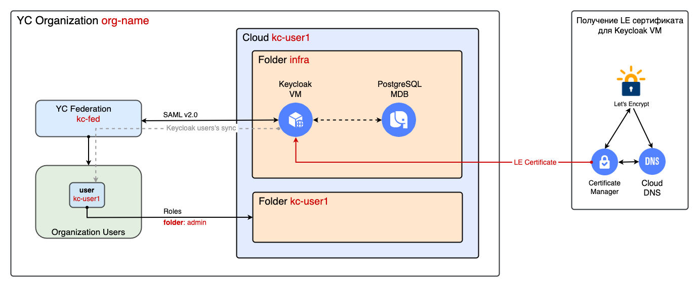

# Развёртывание федерации удостоверений в Yandex Cloud на базе решения Keycloak

## Оглавление
* [Описанние решения](#overview)
* [Архитектура решения](#arch)
    * [Модуль kc-deploy](#kc-deploy)
    * [Модуль kc-config](#kc-config)
    * [Синхронизация данных между TF модулями](#sync-data)
* [Внешние зависимости](#ext-dep)
* [Порядок развёртывание решения](#deploy)
* [Результаты резвёртывания](#results)


## Описание решения <a id="overview"/></a>
Для предоставления доступа корпоративным пользователям к облачным ресурсам в [Yandex Cloud](https://yandex.cloud) используются:
* [сервис организации](https://yandex.cloud/ru/docs/organization/) 
* [федерация удостоверений](https://yandex.cloud/ru/docs/organization/add-federation)
* [Identity Provider](https://en.wikipedia.org/wiki/Identity_provider) (`IdP`)

`Организация` является контейнером для пользователей. В организацию пользователи добавляются и удаляются.

`IdP` выполняет функцию аутентификации и обычно интегрируется с хранилищем учетных данных пользователей, например, MS Active Directory, база данных и т.п.

`Федерация удостоверений` выступает как соединитель между сервисом организации и `IdP`. С помощью федерации учетные записи пользователей из `IdP` синхронизируются в организацию Yandex Cloud.

После успешной синхронизации учетных записей пользователей в организацию Yandex Cloud, им можно [назначать роли](https://yandex.cloud/ru/docs/iam/roles-reference) (выдавать права) на облачные ресурсы. В Yandex Cloud поддерживаются федерации удостоверений на базе стандарта [SAML v2.0](https://wiki.oasis-open.org/security#SAML_V2.0_Standard). Ознакомиться [со списком IdP](https://yandex.cloud/ru/docs/organization/concepts/add-federation#federation-usage), которые были протестированы для работы с федерациями удостоверений в Yandex Cloud вы можете в соответствующем разделе документации. 


В данном решении `аутентификация` пользователя реализована так:
1. Пользователь вводит в браузере URL облачной консоли Yandex Cloud с указанием идентификатора федерации, например, `https://console.yandex.ru/federations/bpf3375ucdgp5dxq823tt`.
2. Облачная консоль перенаправляет запрос пользователя на `IdP`, который развёртывается в виде виртуальной машины (ВМ) с решением [Keycloak](https://keycloak.org).
3. На странице `IdP` пользователь видит форму для аутентификации - ввода имени и пароля.
4. Пользователь вводит свои учетные данные в форму.
5. `idP` проверяет учетные данные пользователя и в случае их успешной проверки возвращает пользователя в консоль Yandex Cloud уже аутентифицированным.
6. `Авторизация` (проверка полномочий) пользователя на облачные ресурсы будет выполняться на стороне Yandex Cloud.
7. После успешной проверки полномочий в облачной консоли пользователь должен увидеть каталоги облачных ресурсов к которым у него есть доступ.


## Архитектура решения <a id="arch"/></a>
Обобщенная архитектура решения показана на рисунке ниже.

<p align="left">
    
</p>

В данном решение `IdP` развёртывается в виде виртуальной машины с [Keycloak](https://keycloak.org).

Данное решение реализовано в виде двух Terraform модулей:
* [keycloak-deploy](#kc-deploy)
* [keycloak-config](#kc-config)

Решение разбито на два модуля, поскольку [Keycloak Terraform провайдер](https://github.com/mrparkers/terraform-provider-keycloak) требует уже работающего (alive) Keycloak.


### Модуль keycloak-deploy <a id="kc-deploy"/></a>
Модуль `keycloak-deploy` создаёт следующие объекты в Yandex Cloud:
* кластер [Managed Service for PostgreSQL](https://yandex.cloud/ru/docs/managed-postgresql/) - для хранения конфигурации Keycloak
* сертификат [Let's Encrypt](https://letsencrypt.org/) для веб-сервера Keycloak
* статический [публичный IP-адрес](https://yandex.cloud/ru/docs/vpc/concepts/address#public-addresses) для ВМ Keycloak
* [группу безопасности](https://yandex.cloud/ru/docs/vpc/concepts/security-groups) для ВМ Keycloak
* ВМ с решением Keycloak 

С полным списком входных параметров модуля можно ознакомиться [по ссылке](./keycloak-deploy/variables.tf).

### Модуль keycloak-config <a id="kc-config"/></a>
Модуль `keycloak-config` выполняет следующие действия:
* создаёт [федерацию удостоверений](https://yandex.cloud/ru/docs/organization/concepts/add-federation) в Yandex Cloud
* создаёт Realm и сопутствующие объекты в конфигурации Keycloak
* обеспечивает обмен сертификатами между федерацией Yandex Cloud и Keycloak Realm
* создаёт учётную запись для тестового пользователя в Keycloak
* импортирует учётную запись тестового пользователя из Keycloak в организацию Yandex Cloud

С полным списком входных параметров модуля можно ознакомиться [по ссылке](./keycloak-config/variables.tf).

После завершения своей работы модуль выдаст ссылку вида, `https://console.yandex.cloud/federations/bpf3375ucdgp5dxq823tt`, которую нужно будет использовать в дальнейшем для подключения к облачным ресурсам через федерацию. После обращения по ссылке вы будете перенаправлены на страницу Keycloak для ввода учетных данных (имя пользователя и пароль).


### Синхронизация данных между TF модулями <a id="sync-data"/></a>
Модуль `keycloak-config` использует часть входных и выходных данных модуля `keycloak-deploy`. 

Развёртывание решения требует последовательного запуска сначала модуля `keycloak-deploy`, а затем модуля `keycloak-config`.

Для исключения ошибок при ручном переносе данных из одного модуля в другой рекомендуется использовать скрипт [sync.sh](./examples/keycloak-config/sync.sh), который синхронизирует нужные данные из модуля `keycloak-deploy` в модуль `keycloak-config`.


## Внешние зависимости  <a id="ext-dep"/></a>
Решение должно развёртываться в уже подготовленной инфраструктуре Yandex Cloud.
Значения параметров инфраструктуры должны передаваться в `TF модули` решения в виде входных переменных. 

Перед развёртывание решения в Yandex Cloud уже должны существовать следующие объекты:
* каталог облачных ресурсов (folder) в котором будут развёртываться компоненты решения (`kc_folder_name`)
* [публичная зона](https://yandex.cloud/ru/docs/dns/concepts/dns-zone#public-zones) в сервисе `Cloud DNS`. Домен, который будет создаваться в сервисе Cloud DNS должен быть предварительно `делегирован` со стороны регистратора домена (`dns_zone_name`)
* сеть (network) в которой будут развёртываться компоненты решения (`kc_network_name`)
* подсеть (subnet) в которой будут развёртываться компоненты решения (`kc_subnet_name`)

В списке выше в круглых скобках указаны имена входных переменных для развёртывания из [keycloak-deploy](./examples/keycloak-deploy/main.tf).


## Порядок развёртывания решения <a id="deploy"/></a>
Развёртывание решения предполагается под управлением ОС `Linux` или `MacOS`.

Развёртывание решения под управлением ОС `Windows` не тестировалось.

0. Перед началом развертывания необходимо убедиться, что необходимые для развертывания инструменты установлены и настроены:
* `yc CLI` - [установлен](https://yandex.cloud/ru/docs/cli/operations/install-cli) и [настроен](https://yandex.cloud/ru/docs/cli/operations/profile/profile-create#create)
* `Terraform` - [установлен](https://yandex.cloud/ru/docs/tutorials/infrastructure-management/terraform-quickstart#install-terraform) и [настроен](https://yandex.cloud/ru/docs/tutorials/infrastructure-management/terraform-quickstart#configure-provider)

1. Загрузить решение из репозитория на [github.com](https://github.com/yandex-cloud-examples/yc-iam-federation-with-keycloak-vm):
    ```bash
    git clone https://github.com/yandex-cloud-examples/yc-iam-federation-with-keycloak-vm.git
    ```

2. Перейти в папку с примером развёртывания модуля [keycloak-deploy](./examples/keycloak-deploy/):
    ```bash
    cd yc-iam-federation-with-keycloak-vm/examples/keycloak-deploy
    ```

3. `Важно!` Убедиться что все [внешние зависимости](#ext-dep) созданы.

4. Проверить значения переменных в файле [main.tf](./examples/keycloak-deploy/main.tf) и скорректировать их при необходимости. 

5. Подготовить среду для развёртывания:
    ```bash
    source ../env-yc.sh
    terraform init
    ```

6. Выполнить развёртывание `keycloak-deploy`:
    ```bash
    terraform apply
    ```
    Обработка запроса на выдачу сертификата в сервисе [Let's Encrypt](https://letsencrypt.org/) может выполняться `до 30 минут`!

7. Проверить состояние выданного сертификата Let's Encrypt:
    ```bash
    yc cm certificate list
    ```

8. Перейти в папку с примером развёртывания модуля [keycloak-config](./examples/keycloak-config/):
    ```bash
    cd ../keycloak-config
    ```

9. Выполнить синхронизацию параметров между TF модулями:
    ```bash
    bash sync.sh
    ```

10. Проверить значения переменных в файле [main.tf](./examples/keycloak-config/main.tf) и скорректировать их при необходимости.

11. Выполнить инициализацию Terraform:
    ```bash
    terraform init
    ```

12. Выполнить развёртывание `keycloak-config`:
    ```bash
    terraform apply
    ```

13. Опционально. Проверить наличие тестовой учётной записи Keycloak в организации Yandex Cloud с помощью `yc CLI`:
    ```bash
    ORG_ID=$(cat terraform.tfstate | jq -r '.resources[] | select(.type == ('\"yandex_organizationmanager_saml_federation\"')) | .instances[0].attributes.organization_id')
    yc organization-manager user list --organization-id=$ORG_ID
    ```

## Результаты развёртывания <a id="results"/></a>

В результате развёртывания решения в Yandex Cloud будут созданы следующие объекты:
* [федерация удостоверений](https://yandex.cloud/ru/docs/organization/concepts/add-federation) в указанной `организации`
* `сертификат` [Let's Encrypt](https://letsencrypt.org/) для ВМ с Keycloak в сервисе [Certificate Manager](https://yandex.cloud/ru/docs/certificate-manager)
* `виртуальная машина` с IdP Keycloak успешно взаимодействует с федерацией удостоверений со стороны Yandex Cloud
* `запись в Yandex Cloud DNS` с публичным IP-адресом ВМ Keycloak
* `учётная запись` пользователя в IdP Keycloak синхронизирована через федерацию в организацию Yandex Cloud

После развёртывания решения останется выдать необходимые [роли](https://yandex.cloud/ru/docs/iam/roles-reference) на нужные облачные ресурсы для созданной в организации учётной записи пользователя.
