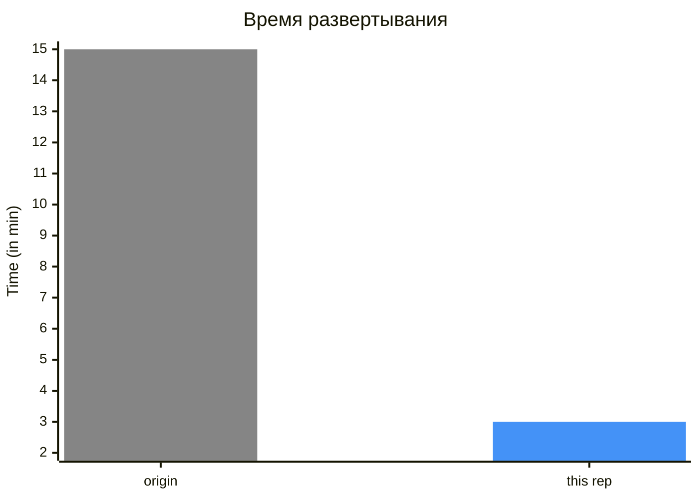
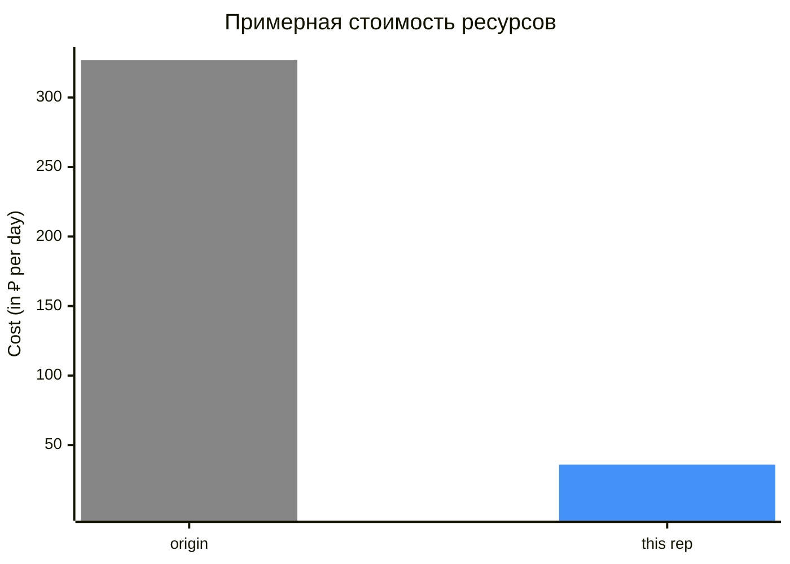

# Развёртывание федерации удостоверений в Yandex Cloud на базе решения Keycloak c помощью Container Optimized Image 

Это fork репозитория [yandex-cloud-examples/yc-iam-federation-with-keycloak-vm](https://github.com/yandex-cloud-examples/yc-iam-federation-with-keycloak-vm). Вы сможете быстро развернуть федерацию удостоверений внутри Docker контейнера на ВМ из образа Container Optimized Image. 

> [!WARNING]  
> Пример использования модулей оптимизирован для быстрого и дешевого равертывания. Пожалуйста, используйте его только в тестовом окружении. В сравнении с origin репозиторием проведено множество упрощений и рационализаций использования ресурсов, что повлияет на безопасность и надёжность. Keycloak также запускается в dev режиме, это необходимо чтобы избежать билда Docker образа, подробнее [в документации Keycloak](https://keycloak.org/server/containers#_trying_keycloak_in_development_mode).

> [!NOTE]  
> В репозитории не реализована удобная конфигурация ролей пользователей, улучшение и переиспользование некоторых переменных. Coming soon...

## Оглавление
* [Fast start](#fast-start)
* [Описанние](#overview)
* [Архитектура](#arch)
    * [Модуль keycloak-deploy](#keycloak-deploy)
    * [Модуль keycloak-config](#keycloak-config)
* [Способы развёртывания](#deploy-ways)
* [Порядок развёртывания](#deploy)
* [Результаты резвёртывания](#results)

---

## Fast start<a id="fast-start"/></a>

0. Клонируйте репозиторий.

    ```
    git clone https://github.com/maqmm/yc-coivm-federation.git
    ```

1. Создайте профиль YC CLI; проверьте, что существуют ресурсы для быстрого запуска.

2. Сразу после клонирования репозитория, для создания федерации выполните команду:

    ```
    cd yc-coivm-federation/examples/keycloak-deploy && terraform init && source ../env-yc.sh && terraform apply -auto-approve && cd ../keycloak-config && terraform init && bash ./sync.sh && bash ./wait_for_keycloak.sh && terraform apply -auto-approve ; cd ..
    ```

После инициализации, __находясь в каталоге `examples` можно__:

* создавать ресурсы

    ```
    cd keycloak-deploy && source ../env-yc.sh && terraform apply -auto-approve && cd ../keycloak-config && bash ./sync.sh && bash ./wait_for_keycloak.sh && terraform apply -auto-approve ; cd ..
    ```

* удалять ресурсы

    ```
    cd keycloak-config && terraform destroy -auto-approve && cd ../keycloak-deploy && terraform destroy -auto-approve ; cd ..
    ```

---

## Описание<a id="overview"/></a>
Подробную информацию о схеме работы и функционировании федераций можно прочитать в [origin репозитории](https://github.com/yandex-cloud-examples/yc-iam-federation-with-keycloak-vm?tab=readme-ov-file#overview) или [документации Yandex Cloud](https://yandex.cloud/ru/docs/organization/concepts/add-federation). 
Примерное взаимодействие браузера пользователя, SP и IdP при входе показано на схеме:


1. Пользователь переходит по ссылке `https://console.yandex.cloud/federations/<FED_ID>`. Происходит несколько редиректов к `auth.yandex.cloud`. Генерируется SAMLRequest. В браузер возвращается редирект к SSO URL, указанный в федерации удостоверений.

2. Браузер переходит по указанному location в редиректе. В URL query params подставлен SAMLRequest. IdP валидирует SAMLRequest и отправляет форму ввода аутентификационных данных в HTML странице.

3. Пользователь заполняет форму. После нажатия кнопки отправляется POST запрос. IdP валидирует введенные данные. Если проверка прошла успешно, на стороне IdP генерируется SAMLResponse, подставляется в готовый POST запрос, который в свою очередь подставляется в HTML auto-submit форму, которая выполняется при загрузке HTML документа.

4. Браузером загружается страница с формой и POST запрос с SAMLResponse отправляется к SP по ASC USL. Происходит редирект на `https://console.yandex.cloud/`.

### Перейдём сразу к плюсам:



```mermaid
---
config:
    themeVariables:
        xyChart:
            backgroundColor: "#00000000"
            plotColorPalette: "#858585, #4492f7"
---
xychart-beta
    title "Время развертывания"
    x-axis ["origin", "this rep"]
    y-axis "Time (in min)" 2 --> 15
    bar [15, -999]
    bar [-999, 3]
```


```mermaid
---
config:
    themeVariables:
        xyChart:
            backgroundColor: "#00000000"
            plotColorPalette: "#858585, #4492f7"
---
xychart-beta
    title "Примерная стоимость ресурсов"
    x-axis ["origin", "this rep"]
    y-axis "Cost (in ₽ per day)" 2 --> 330
    bar [327, -999]
    bar [-999, 36]
```

### Отличия от [origin репозитория](https://github.com/yandex-cloud-examples/yc-iam-federation-with-keycloak-vm?tab=readme-ov-file#overview)
* Вместо Managed PostgreSQL кластера используется dev-file самого Keycloak.
* [Keycloak](https://keycloak.org/server/containers) запускается в виде Docker контейнера на ВМ из образа [Container Optimized Image](https://yandex.cloud/ru/docs/cos/concepts/).
* Поддерживается переиспользование и определение уже выпущенного [Let's Encrypt](https://letsencrypt.org/) сертификата, что увеличивает скорость развертывания.
* При начальной конфигурации необходимо указать лишь [DNS зону](https://yandex.cloud/ru/docs/dns/concepts/dns-zone#public-zones) и правильно настроить [YC CLI профиль](https://yandex.cloud/ru/docs/cli/operations/authentication/user). После этого возможно будет развернуть решение в одну сборную команду.

---

## Архитектура решения<a id="arch"/></a>

В примере используется образ [Container Optimized Image](https://yandex.cloud/ru/docs/cos/concepts/), для виртуальной машины. [Keycloak](https://keycloak.org/server/containers) запускается из Docker образа, переданного в [Docker Compose](https://yandex.cloud/ru/docs/cos/concepts/coi-specifications#compose-spec) спецификацию, в виде [метаданных ВМ](https://yandex.cloud/ru/docs/compute/concepts/vm-metadata).

Решение разбито на два модуля, поскольку [Keycloak Terraform провайдер](https://github.com/keycloak/terraform-provider-keycloak) требует уже работающего (alive) Keycloak, а [блоки `provider` не поддерживают `depends_on`](https://discuss.hashicorp.com/t/depends-on-in-providers/42632).

### Модуль keycloak-deploy<a id="keycloak-deploy"/></a>

#### Переменные модуля keycloak-deploy<a id="keycloak-deploy/variables"/></a>

В столбце __Порядок получения в примере__ указаны варианты получения этой переменной в [examples/](./examples/) при применении манифеста от самого приоритетного к менее.

| __Переменная__ | __Дефолтное значение__ | __Тип__ | __Описание__ | __Порядок получения в примере__ |
| ---         | ---         | ---         | ---         | ---         |
| _Input variables_ |
| `cloud_id` | - | `string` | ID облака | 1. `var.YC_CLOUD_ID` указанное в [examples/keycloak-deploy/main.tf](./examples/keycloak-deploy/main.tf) из переменной `TF_VAR_YC_CLOUD_ID`, экспортированной скриптом [env-yc.sh](./examples/env-yc.sh) |
| `folder_id` | - | `string` | ID облака | 1. `var.YC_FOLDER_ID` указанное в [examples/keycloak-deploy/main.tf](./examples/keycloak-deploy/main.tf) из переменной `YC_FOLDER_ID`, экспортированной скриптом [env-yc.sh](./examples/env-yc.sh) |
| `labels` | null | `map(string)` | Пары ключ/значения меток для ресурсов | 1. `{ tag = "keycloak-deploy" }` указанное в [examples/keycloak-deploy/main.tf](./examples/keycloak-deploy/main.tf) |
| _VM variables_ |
| `kc_image_family` | null | `string` | Семейство образов, используемых для ВМ | 1. `container-optimized-image` указанное в [examples/keycloak-deploy/main.tf](./examples/keycloak-deploy/main.tf) |
| `kc_preemptible` | `false` | `bool` | Прерываемая ли ВМ | 1. `true` указанное в [examples/keycloak-deploy/main.tf](./examples/keycloak-deploy/main.tf)<br>2. `false` как значение по умолчанию |
| `kc_zone_id` | `ru-central1-d` | `string` | Зона размещения ВМ | 1. `ru-central1-d` указанное в [examples/keycloak-deploy/main.tf](./examples/keycloak-deploy/main.tf)<br>2. `ru-central1-d` как значение по умолчанию |
| `kc_hostname` | `sso` | `string` | Будет использовано для `name` и `hostname` ВМ, а также как субдомен. | 1. `fed` указанное в [examples/keycloak-deploy/main.tf](./examples/keycloak-deploy/main.tf)<br>2. `sso` как значение по умолчанию |
| `kc_vm_cores` | `2` | `number` | Количество vCPU ВМ | 1. `2` как значение по умолчанию |
| `kc_vm_memory` | `2` | `number` | Количество RAM ВМ в GB | 1. `2` как значение по умолчанию |
| `kc_vm_core_fraction` | `100` | `number` | Уровень производительности ВМ в процентах | 1. `100` как значение по умолчанию |
| `kc_vm_username` | `admin` | `string` | Имя пользователя ВМ, передаваемое в метаданные | 1. `admin` указанное в [examples/keycloak-deploy/main.tf](./examples/keycloak-deploy/main.tf)<br>2. `admin` как значение по умолчанию |
| `kc_vm_ssh_pub_file` | null | `string` | Путь и имя файла публичного SSH-ключа | 1. `~/.ssh/id_rsa.pub` указанное в [examples/keycloak-deploy/main.tf](./examples/keycloak-deploy/main.tf) |
| `kc_vm_ssh_priv_file` | null | `string` | Путь и имя файла публичного SSH-ключа | 1. Использует указанное в [examples/keycloak-deploy/main.tf](./examples/keycloak-deploy/main.tf) значени<br>2. Если не указано, то подставляется `null` по умолчанию, в модуле используется значение переменной `kc_vm_ssh_pub_file` с удаленным `.pub` |
| _Keycloak variables_ |
| `kc_ver` | `24.0.0` | `string` | Используемая версия Keycloak | 1. `26.1.1` указанное в [examples/keycloak-deploy/main.tf](./examples/keycloak-deploy/main.tf)<br>2. `24.0.0` как значение по умолчанию |
| `kc_adm_user` | null | `string` | Имя пользователя администратора Keycloak | 1. `admin` указанное в [examples/keycloak-deploy/main.tf](./examples/keycloak-deploy/main.tf) |
| `kc_adm_pass` | null | `string` | Пароль администратора Keycloak | 1. Генерируется и подставляется значение при запуске скрипта [env-yc.sh](./examples/env-yc.sh) при условии что в обоих main.tf эта переменная равна `""` <br>2. `""` указанное в [examples/keycloak-deploy/main.tf](./examples/keycloak-deploy/main.tf) |
| _VPC variables_ |
| `kc_network_name` | null | `string` | Имя сети | 1. `forkc` указанное в [examples/keycloak-deploy/main.tf](./examples/keycloak-deploy/main.tf) |
| `kc_subnet_name` | null | `string` | Имя подсети | 1. `forkc-ru-central1-d` указанное в [examples/keycloak-deploy/main.tf](./examples/keycloak-deploy/main.tf) |
| `kc_subnet_exist` | null | `string` | ID существующей подсети. Если указать эту переменную подсеть и сеть создаваться не будут, а будет использоваться указанная подсеть. | - |
| `kc_port` | `8443` | `string` | Порт Keycloak | 1. `8443` указанное в [examples/keycloak-deploy/main.tf](./examples/keycloak-deploy/main.tf)<br>2. `8443` как значение по умолчанию |
| `kc_vm_sg_name` | `kc-sg` | `string` | Имя группы безопасности | 1. `kc-sg` указанное в [examples/keycloak-deploy/main.tf](./examples/keycloak-deploy/main.tf)<br>2. `kc-sg` как значение по умолчанию |
| _DNS zone variables_ |
| `dns_zone_id` | null | `string` | ID DNS зоны | Для создания DNS зоны:<br>1. Значение из `dns_zone_id`<br>2. Имя из `dns_zone_name`<br>3. Если публичная DNS зона одна в каталоге, то используется она из переменной `var.YC_ZONE_ID` при запуске скрипта [env-yc.sh](./examples/env-yc.sh). |
| `dns_zone_name` | null | `string` | Имя DNS зоны | Для создания DNS зоны:<br>1. Значение из `dns_zone_id`<br>2. Имя из `dns_zone_name`<br>3. Если публичная DNS зона одна в каталоге, то используется она из переменной `var.YC_ZONE_ID` при запуске скрипта [env-yc.sh](./examples/env-yc.sh). |
| _LE Certificate variables_ |
| `kc_cert_exist` | null | `string` | ID готового сертификата, если указать сертификат не будет создаваться и валидироваться | 1. `var.CERTIFICATE_ID` указанное в [examples/keycloak-deploy/main.tf](./examples/keycloak-deploy/main.tf) из переменной `TF_VAR_CERTIFICATE_ID`, экспортированной скриптом [env-yc.sh](./examples/env-yc.sh) |
| `le_cert_name` | null | `string` | Имя сертификата, который будет создан | 1. `kc` указанное в [examples/keycloak-deploy/main.tf](./examples/keycloak-deploy/main.tf) |
| `le_cert_descr` | null | `string` | Описание сертификата, который будет создан | - |

#### Ресурсы модуля keycloak-deploy<a id="keycloak-deploy/resources"/></a>

Граф зависимостей ресурсов модуля. Полузакрашенные ресурсы не будут созданы, если есть и указаны уже существующие.


| __Ресурс__ | __Описание__ |
| ---         | ---         |
| `data.yandex_resourcemanager_folder.kc_folder` | ---         |
| `null_resource.copy_certificates` | ---         |
| _VPC_ |
| `yandex_vpc_network.kc_net` | ---         |
| `yandex_vpc_subnet.kc_subnet` | ---         |
| `data.yandex_vpc_subnet.kc_subnet_existing` | ---         |
| `yandex_vpc_security_group.kc_sg` | ---         |
| `yandex_vpc_address.kc_pub_ip` | ---         |
| _Compute_ |
| `data.yandex_compute_image.kc_image` | ---         |
| `yandex_compute_instance.kc_vm` | ---         |
| _Cloud DNS_ |
| `data.yandex_dns_zone.kc_dns_zone` | ---         |
| `yandex_dns_recordset.kc_dns_rec` | ---         |
| `yandex_dns_recordset.validation_dns_rec` | ---         |
| _Certificate Manager_ |
| `yandex_cm_certificate.kc_le_cert` | ---         |
| `data.yandex_cm_certificate.cert_existing` | ---         |
| `data.yandex_cm_certificate.cert_validated` | ---         |
| `data.yandex_cm_certificate_content.cert` | ---         |
| `local_file.cert` | ---         |
| `local_file.key` | ---         |

Чтобы получить название в _state_, нужно добавить префикс перед названием ресурса:
`module.keycloak-deploy.<название_ресурса_из_первого_столбца>`

### Модуль keycloak-config<a id="keycloak-config"/></a>
...

#### Переменные модуля keycloak-config<a id="keycloak-config/variables"/></a>
...

#### Ресурсы модуля keycloak-config<a id="keycloak-config/resources"/></a>

Граф зависимостей ресурсов модуля. Множественными элементами обозначены ресурсы, количество которых зависит от конфигурации.


| __Ресурс__ | __Описание__ |
| ---         | ---         |
| _Cloud Organization_ |
| `data.yandex_client_config.client` | ---         |
| `yandex_organizationmanager_saml_federation.kc_fed` | ---         |
| `null_resource.federation_cert` | ---         |
| `yandex_organizationmanager_saml_federation_user_account.org_users` | ---         |
| _Keycloak_ |
| `keycloak_realm.realm` | ---         |
| `keycloak_saml_client.client` | ---         |
| `keycloak_realm_user_profile.user_profile` | ---         |
| `random_password.user_password` | ---         |
| `keycloak_user.users` | ---         |
| `keycloak_saml_user_property_protocol_mapper.property_email` | ---         |
| `keycloak_saml_user_property_protocol_mapper.property_surname` | ---         |
| `keycloak_saml_user_property_protocol_mapper.property_givenname` | ---         |
| `keycloak_saml_user_attribute_protocol_mapper.attribute_fullname` | ---         |
| `keycloak_saml_user_attribute_protocol_mapper.attribute_phone` | ---         |
| `keycloak_saml_user_attribute_protocol_mapper.attribute_avatar` | ---         |
| `keycloak_generic_protocol_mapper.role_list_mapper` | ---         |
| `keycloak_generic_protocol_mapper.group_membership` | ---         |

Чтобы получить название в _state_, нужно добавить префикс перед названием ресурса:
`module.keycloak-config.<название_ресурса_из_первого_столбца>`

## Способы развёртывания решения<a id="deploy-ways"/></a>
...

---

## Порядок развёртывания<a id="deploy"/></a>

### Настройка профиля YC CLI<a id="yc-cli"/></a>

Для начала рекомендую [создать отдельный профиль YC CLI](https://yandex.cloud/ru/docs/cli/operations/profile/profile-create).

> [!NOTE] 
> Вы можете создать отдельный профиль YC CLI для использования с этой конфигурацией. После этого указать его имя в переменной `YC_PROFILE=""` файла [env-yc.sh](./examples/env-yc.sh#L4), а потом активировать любой необходимый. После сохранения файла во всех его командах будет использоваться указанный профиль вместо текущего по умолчанию.

При настройке профиля помимо аутентификационных данных укажите:
- ID облака - `yc config set cloud-id <id>`
- ID каталога - `yc config set folder-id <id>`
- ID организации, если не указать будет использована организация облака - `yc config set organization-id <id>`

---

### Пошагово разберем какие действия выполняются в каждой из частей сборной команды:<a id="steps"/></a>

```
cd yc-coivm-federation/examples/keycloak-deploy && terraform init && source ../env-yc.sh && terraform apply -auto-approve && cd ../keycloak-config && terraform init && bash ./sync.sh && bash ./wait_for_keycloak.sh && terraform apply -auto-approve ; cd ..
```

#### Переход в директорию [examples/keycloak-deploy](./examples/keycloak-deploy) и инициализация<a id="steps/cd-k-d"/></a>

Изменение директории после `git clone https://github.com/maqmm/yc-coivm-federation.git`:
```
cd yc-coivm-federation/examples/keycloak-deploy
```

Инициализация провайдеров модуля `keycloak-deploy`:
```
terraform init
```

#### Скрипт `env-yc.sh`, устанавливающий переменные окружения<a id="steps/env-yc"/></a>

Команда `source` использует текущий shell для экспорта переменных окружений, на основе которых будет выполняться `terraform plan & apply`. При изменении shell'а или истечения 12 часов валидности IAM токена, выполняйте команду:

```
source ../env-yc.sh
```

##### Устанавливаются следующие переменные окружения:<a id="steps/env-yc/env"/></a>
| __Переменная__ | __Значение__ |
| ---         | ---         |
| `YC_TOKEN` | IAM-токен, полученный с помощью команды `yc iam create-token` |
| `TF_VAR_YC_CLOUD_ID` | ID облака, указанного в профиле |
| `TF_VAR_YC_FOLDER_ID` | ID каталога, указанного в профиле |
| `TF_VAR_YC_ORGANIZATION_ID` | ID организации |
| `TF_VAR_YC_ZONE_ID` | ID публичной DNS зоны |
| `TF_VAR_CERTIFICATE_ID` | ID сертификата |

##### Шаги<a id="steps/env-yc/steps"/></a>

1. Использует для выполнения команд текущий профиль YC CLI. Подробнее про [настройку профиля YC CLI](#yc-cli).
2. Устанавливает переменную `YC_TOKEN` командой `yc iam create-token`.
3. Устанавливает переменную `TF_VAR_YC_CLOUD_ID` командой `yc config get cloud-id`.
4. Устанавливает переменную `TF_VAR_YC_FOLDER_ID` командой `yc config get folder-id`.
5. Устанавливает переменную `TF_VAR_YC_ORGANIZATION_ID` командой `yc config get organization-id`, но если `organization-id` не указана в используемом профиле получает ID организации используемого выше облака командой `yc resource-manager cloud get`.
6. Устанавливает переменную `TF_VAR_YC_ZONE_ID`, если в указанном выше каталоге одна публичная зона.
7. Ищет файлы `main.tf`, если в обоих файлах `kc_adm_pass = ""`, генерирует и подставляет значения между кавычек. _(нужно для безопасности при клонировании репозитория)_
8. Использует зону из следующих источников (отсортировано по уменьшению приоритета): сначала `dns_zone_id` из файла [examples/keycloak-deploy/main.tf](./examples/keycloak-deploy/main.tf); `dns_zone_name` из файла [examples/keycloak-deploy/main.tf](./examples/keycloak-deploy/main.tf); `TF_VAR_YC_ZONE_ID` установленный в пункте 6, если в каталоге единственная публичная DNS зона. 
    Получает `kc_hostname` из файла [examples/keycloak-deploy/main.tf](./examples/keycloak-deploy/main.tf). 
    Устанавливает переменную `TF_VAR_CERTIFICATE_ID`, записывая в неё id `ISSUED` сертификата, если такой существует в каталоге для полученного ранее в этом пункте FQDN: `<kc_hostname>.<ZONE>`.
9. Выводит переменные, которые удалось установить с помощью `echo`.

---

## Результаты резвёртывания<a id="results"/></a>
...